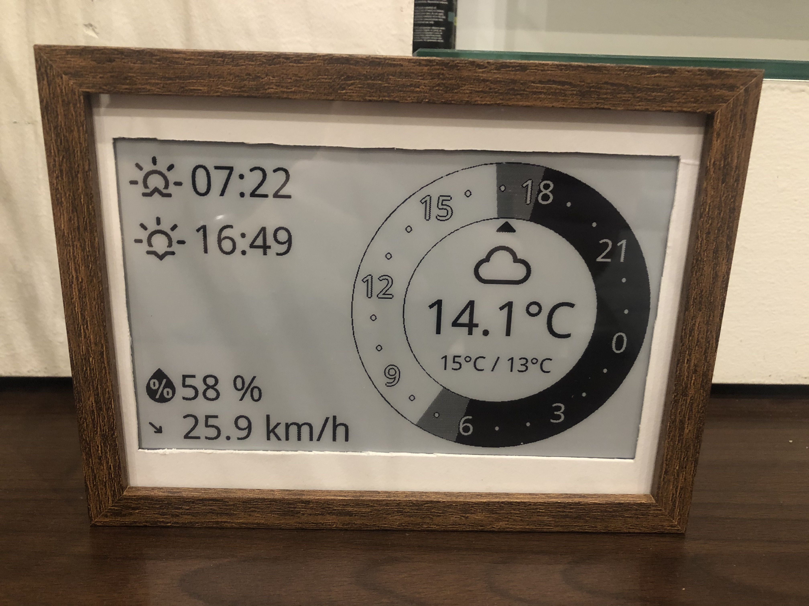
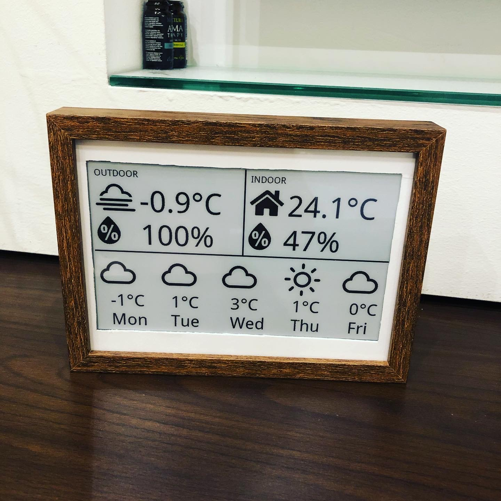
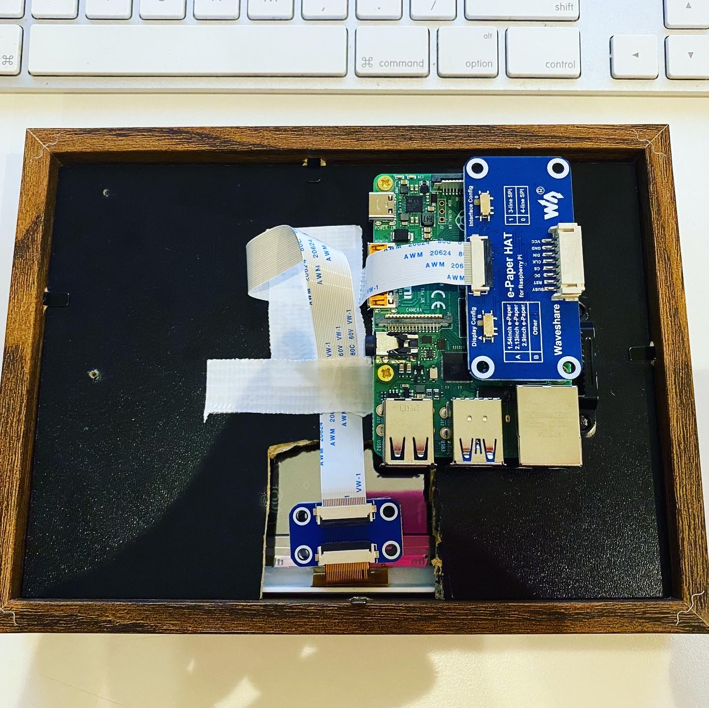

# WeatherFrame
This repository contains the software and the list of hardware required to make a DIY weather frame. This was a quick project I did during the winter of 2019.

**⚠️ I do not plan to actively maintain this repository, but one of these does sit in our living room, so I might make some changes in the future. Use it as an inspiration for your own DIY project.**

# Photo & Screenshots




## Hardware
* __Raspberry Pi 4__  
  [https://www.raspberrypi.org/products/raspberry-pi-4-model-b](https://www.raspberrypi.org/products/raspberry-pi-4-model-b)
* __WaveShare e-Ink display__
  [https://www.waveshare.com/product/displays/e-paper/epaper-1/7.5inch-e-paper-hat.htm](https://www.waveshare.com/product/displays/e-paper/epaper-1/7.5inch-e-paper-hat.htm)
* __Any photo frame of your liking__

## Software
* Python 3
* OpenWeatherMap API Key
  [https://openweathermap.org/api](https://openweathermap.org/api)

# Setup & Run
There are basically 3 layers in which you can run this project.
1. Rendering screens
2. Displaying the rendered screens
3. Running the Web UI to control the frame
#### 1. Rendering layer
Install the dependencies
```bash
$ pip install -r requirements.txt
```
Render a screen manually
```bash
$ python3 render.py\ 
--type <type>\ 
--lat <latitude>\ 
--long <longitude>\ 
--owm <owm_key>
```
| Param | Value | Description |
| ----- | ----- | ----------- |
| type | `ring` or `quadrant` | Which screen type to render |
| lat  | float | Latitude of your geolocation |
| long | float | Longitutde of your geolocation |
| owm | string | OpenWeatherMap API Key |

**Example**
```bash
$ python3 render.py\ 
--type ring\ 
--lat 47.604847\ # Seattle, WA
--long -122.3436885\ 
--owm abcdef1234567890abcdef1234567890 # Invalid OWM API Key
```
#### 2. Display on screen
⚠️ This part must be run on an Raspberry Pi ⚠️
**Example**
```bash
$ python3 manual.py\ 
--type ring\ 
--lat 47.604847\ 
--long -122.3436885\ 
--owm abcdef1234567890abcdef1234567890
```

#### 3. Web UI
```bash
export FLARECHECK_ENV=development
flask run
```
# Acknowledgements

* [WaveShare e-Paper GitHub repository](https://github.com/waveshare/e-Paper)
* [Font Awesome GitHub repository](https://github.com/FortAwesome/Font-Awesome)
* [Weather Icons GitHub repository](https://github.com/erikflowers/weather-icons)
